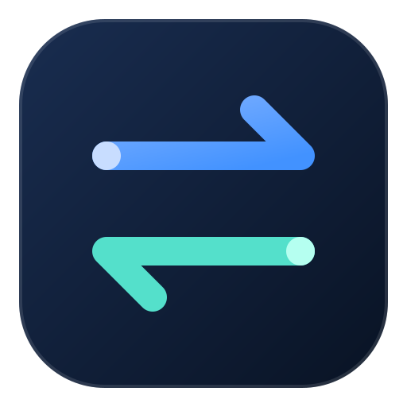

# AIModel Switch



面向 Codex 和 Claude Code 的桌面配置管理工具，集中管理账号、API 接口、供应商和模型，方便在不同账号与配置之间切换。

## 功能

### Codex 账号管理

- **OAuth 授权**：支持浏览器授权、设备授权和手动回调，也可以先保存待授权账号。
- **Token / JSON 接入**：通过令牌或 JSON 账号数据添加账号。
- **API Key 接入**：配置供应商接口地址、密钥和模型。
- **本地与文件导入**：导入本地账号或已有账号文件。
- **日常管理**：账号分组、备注、切换、额度查询与导入导出。

### Claude Code 配置

- 支持 OAuth、API 密钥和本地 JSON 接入。
- 管理供应商、接口地址、密钥和模型配置。
- 管理多个账号与配置，按使用场景切换。

### 供应商与模型

- 提供多种供应商预设，也支持自定义供应商与接口地址。
- 复用已保存的供应商和密钥，减少重复填写。
- 支持从上游接口获取模型列表，管理模型目录与相关同步配置。

### 配套工具

- **Codex API 服务**：在桌面端管理本地 API 服务。
- **实例管理**：管理 Codex 和 Claude Code 的多个运行实例。
- **系统托盘**：快速访问账号与相关操作。
- **浅色 / 深色主题**：提供两种主题，增强文字对比度与表单可读性。

## 使用方式

1. 打开应用，选择 Codex 或 Claude Code。
2. 根据需要使用 OAuth、API Key 或导入方式添加账号。
3. 使用第三方接口时，选择供应商预设或填写自定义接口地址，再配置密钥和模型。
4. 保存后，在账号或配置列表中管理、切换和查看状态。

使用成品应用无需自行部署数据库或服务器，也不需要安装 Node.js、Rust 或 Go。访问模型接口需要可用的账号或 API 密钥；相关编程工具需单独安装。

## 数据与隐私

- 应用账号数据保存在本机 `~/.aimodel_switch`，可通过 `AIMODEL_SWITCH_DATA_DIR` 指定其他目录。
- 支持账号导入导出；令牌、密钥及备份文件可能包含敏感信息，请妥善保存，不要公开提交。
- 默认关闭诊断上报、插件 WebSocket 和 Codex UI 注入。
- 不加载广告或远端公告；当前版本不启用自动更新。

## 本地开发

需要 Node.js 22、Rust stable、Go 1.26+，以及对应操作系统的 Tauri 构建环境。Go 用于构建随应用分发的 API 服务辅助进程。

```sh
npm ci
npm run tauri dev
```

检查与构建：

```sh
npm run build
npm test
cargo check -p cockpit-tools
npm run tauri build -- --bundles app
```

macOS 遇到 Command Line Tools 的 SwiftPM `PackageDescription` 接口与动态库不匹配时，可设置 `AIMODEL_DIRECT_SWIFT=1` 后重试构建。正常工具链无需此开关。

## 许可

遵循 CC BY-NC-SA 4.0。版权与第三方署名见 [许可与署名说明](UPSTREAM.md)。
